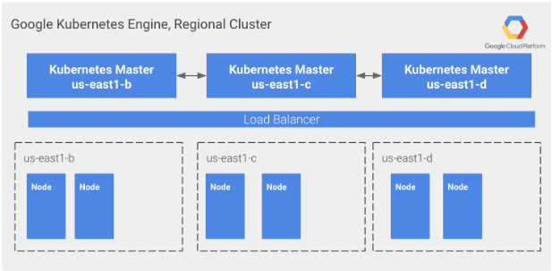

# Zimagi Cluster on GKE

## Introduction

Terraform module for deploy a gke cluster for Zimagi cluster. Provisioning contains the following resources:

* VPC
* Subnet
* Kubernetes Controle Plane
* Linux Node Pool
* IAM Service Acccount

## Folder structure

The root folder contains the terraform configuration of provisioning, test folder, circleci configuration and examples folder.

* Root module files:
  * main.tf: contains the logic of provisioning
  * outputs.tf: register attributes of deployed resources
  * variables.tf: varaiable definition of module
  * versions.tf: terraform's provider version requirements
* Circleci: ./.circle folder contains the jobs of the cicd project
* test: automated tests are found here
* examples: preconfigured examples
## Configure cluster

Module can be configured by .tfvars file.

## Network Design

This section is outlines the configuration of the network for Google Kubernetes Engine (GKE) cluster. This VPC network contains all the Google suggested [best practices](https://cloud.google.com/kubernetes-engine/docs/best-practices/networking).

### VPC Native cluster

Google provides two differnet type of cluster according to network settings either [route-based](https://cloud.google.com/kubernetes-engine/docs/how-to/routes-based-cluster) or [vpc native](https://cloud.google.com/kubernetes-engine/docs/concepts/alias-ips) cluster.

We have chosen vpc native cluster because it has more advantages for us than a simple route based one. This is one of the requirement for using Nginx-Ingress Controller. Also our cluster can apply [Shared VPC Network architecture](https://cloud.google.com/kubernetes-engine/docs/best-practices/networking#sharedvpc_networks).

### Advantages of VPC Native Cluster

* Pod IP addresses are natively routable within the cluster's VPC network and other VPC networks connected to it by VPC Network Peering.
* Pod IP addresses are reserved in the VPC network before the Pods are created in your cluster. This prevents conflict with other resources in the VPC network and allows you to better plan IP address allocations.
* Pod IP address ranges do not depend on custom static routes. They do not consume the system-generated and custom static routes quota. Instead, automatically-generated subnet routes handle routing for VPC-native clusters.
* You can create firewall rules that apply to just Pod IP address ranges instead of any IP address on the cluster's nodes.
* Pod IP address ranges, and subnet secondary IP address ranges in general, are accessible from on-premises networks connected with Cloud VPN or Cloud Interconnect using Cloud Routers.

### IP address ranges for VPC-native clusters

When we are creating a VPC-native cluster we specify a subnet in VPC. CLuster uses 3 unique subnet ranges:

* Nodes use subnet's primary ip range.
* Pods use one subnet's secondary ip range.
* Services use another subnet's secondary ip range.

### IP Adress planning

Each subnet has a primary IPv4 address range. The primary internal addresses for the following resources come from the subnet's primary range: VM instances, internal load balancers, and internal protocol forwarding. You can optionally add secondary IP address ranges to a subnet, which are only used by alias IP ranges. However, you can configure alias IP ranges for instances from the primary or secondary range of a subnet.

Each primary or secondary IPv4 range for all subnets in a VPC network must be a unique valid CIDR block. Refer to the per network limits for the number of secondary IP address ranges you can define.

Your IPv4 subnets don't need to form a predefined contiguous CIDR block, but you can do that if desired. For example, auto mode VPC networks do create subnets that fit within a predefined auto mode IP range.

We have to carefully plan our primary - and secondary IP address ranges. Though it is possible to replace a subnet's secondary IP address range, doing so is not supported because it has the potential to put the cluster in an unstable state.

#### Valid IPv4 ranges

A subnet's primary and secondary IPv4 address ranges are regional internal IPv4 addresses. The following table describes valid ranges.

| Range | Description |
| --- | --- |
| Private IPv4 address ranges | |
| 10.0.0.0/8 | Private IP addresses RFC 1918 |
| 172.16.0.0/12| Private IP addresses RFC 1918 |
| 192.168.0.0/16| Private IP addresses RFC 1918 |
| 100.64.0.0/10 | 	IETF protocol assignments RFC 6890 |
| 192.0.0.0/24 | IETF protocol assignments RFC 6890 |
| 192.0.2.0/24 (TEST-NET-1) | Documentation RFC 5737 |
| 198.51.100.0/24 (TEST-NET-2) | Documentation RFC 5737 |
| 203.0.113.0/24 (TEST-NET-3) | Documentation RFC 5737 |
| 198.18.0.0/15 | Benchmark testing RFC 2544 |
| 240.0.0.0/4 | Reserved for future use (Class E) as noted in RFC 5735 and RFC 1112 |

#### Calculate Primary IP Address ranges for Nodes

Useful formulas:

* Calculate the maximum number of nodes, N, that a given netmask can support. Use S for the size of the netmask, whose valid range is between 8 and 29, inclusive.

  $N = 2^{32 -S} - 4$

* Calculate the size of the netmask, S, required to support a maximum of N nodes:

  $S = 32 - ⌈log2(N + 4)⌉$

*⌈⌉ is the ceiling (least integer) function, meaning round up to the next integer. The valid range for the size of the netmask, S, is between 8 and 29, inclusive.*

#### Calculate Secondary IP Adress range for Pods

| secondary IP range | Maximum Pod IP addresses | Maximum nodes	| Maximum Pods |
| --- | --- | --- | ---- |
| /24 | 256 addresses | 1 | 110  |
| /23 | 512 addresses | 2 | 220 |
| /22 | 1,024 addresses | 4 | 440 |
| /21 | 2,048 addresses | 8 | 880 |

#### Calculate Secondary IP Adress range for Pods

Secondary IP address range for Services, can only be replaced when no Google Cloud resources use it. This range cannot be changed as long as a cluster uses it for Services (cluster IP addresses).

Unlike node and Pod IP address ranges, each cluster must have a unique subnet secondary IP address range for Services and cannot be sourced from a shared primary or secondary IP range.

| Secondary IP range for Services | Maximum number of Services |
| --- | --- |
| /28 | 16 |
| /27 | 32 |
| /26 | 64 |
| /25 | 128 |

#### Privately used public ranges

GKE clusters can privately use certain public IP address ranges as internal, subnet IP address ranges. It can privately use any public IP address except for certain restricted ranges as described the VPC network documentation.

Privately used public ranges are subnet ranges – you can use them exclusively or in conjunction with other subnet ranges that use private addresses. Nodes, Pods, and Services continue to use subnet ranges as described in IP ranges for VPC-native clusters. Keep the following in mind when re-using public IP addresses privately:

* When you use a public IP address range as a subnet range, your cluster can no longer communicate with systems on the Internet that use that public range – the range becomes an internal IP address range in the cluster's VPC network.
* Subnet ranges, even those that privately use public IP address ranges, must be assigned manually or by GKE before the cluster's nodes are created. You cannot switch to or cease using privately used public IP addresses unless you replace the cluster.

GKE by default implements SNAT on the nodes to public IP destinations. When using privately used public IP address ranges for the Pod CIDR this would result in the SNAT rules applied to Pod to Pod traffic. To avoid this you have 2 options:

* Deploy your cluster with option the `default_snat_status: {enabled: false}` . For more details about this options, refer to I[P masquerading in GKE](https://cloud.google.com/kubernetes-engine/docs/how-to/ip-masquerade-agent#how_ipmasq_works).
* Configure the configMap `ip-masq-agent` including in the `nonMasqueradeCIDRs` list at least the Pod CIDR, the Service CIDR, and the nodes subnet.

#### Example with privately used public ranges

* Nodes use the 10.0.0.0/24 primary IP address range of the subnet.
* Pods privately use the 5.0.0.0/16 public IP address range as the subnet's secondary IP address range for Pods.
* Services privately use the 5.1.0.0/16 public IP address range as the subnet's secondary IP address range for Services.
* The internal IP address range for the control plane is 172.16.0.16/**28**

### Regional Cluster

In regional cluster the cluster's control plane is replicated across multiple zones in a given region. For node pools in a regional cluster, you can manually specify the zone(s) in which to run the node pools or you can use the default configuration, which replicates each node pool across three zones of the control plane's region. All zones must be within the same region as the cluster's control plane.

By creating a regional cluster, you get:

* Resilience from single zone failure - Because your masters and application nodes are available across a region rather than a single zone, your Kubernetes cluster is still fully functional if an entire zone goes down.
* No downtime during master upgrades - Kubernetes Engine minimizes downtime during all Kubernetes master upgrades, but with a single master, some downtime is inevitable. By using regional clusters, the control plane remains online and available, even during upgrades.